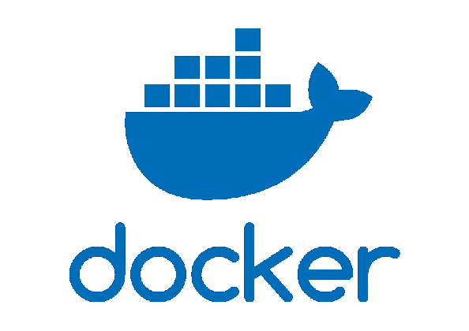
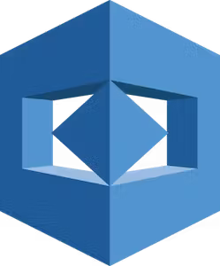

# 👥 SemiSocial

<div align="center"></div>

# Manual Técnico

## INDICE

- [👥 SemiSocial](#-semisocial)
- [Manual Técnico](#manual-técnico)
  - [INDICE](#indice)
  - [Introducción](#introducción)
  - [Objetivos](#objetivos)
    - [Objetivo General](#objetivo-general)
    - [Objetivos Específicos](#objetivos-específicos)
  - [Arquitectura del Proyecto](#arquitectura-del-proyecto)
  - [Estructura del Proyecto](#estructura-del-proyecto)
  - [Descripción de los Servicios de AWS](#descripción-de-los-servicios-de-aws)
    - [Amazon S3](#amazon-s3)
    - [Amazon Rekognition](#amazon-rekognition)
    - [Amazon Translate](#amazon-translate)
    - [Amazon Lex](#amazon-lex)
    - [Amazon Cógnito](#amazon-cógnito)
    - [Amazon EC2](#amazon-ec2)
    - [Amazon API Gateway](#amazon-api-gateway)
    - [Amazon Lambda](#amazon-lambda)
    - [IAM](#iam)
  - [Conclusiones](#conclusiones)

## Objetivos

### Objetivo General

### Objetivos Específicos
 1. Estructurar eficientemente el proyecto.
 2. Implementar servicios y APIs de AWS

## Arquitectura del Proyecto


## Estructura del Proyecto

### React

<div align="center"></div>

Para la realización del frontend, se utilizó la librería Javascript de código abierto denominada **React**. Para su utilización, se creó el entorno de desarrollo con _*Vite*_ de la siguiente manera:

```
npm create vite@latest [Nombre del Proyecto] --template react
```

y para su ejecución, se utilizó el comando:

```
npm run dev
```

El proyecto se estructuró de tal manera para su fácil configuración, edición y que a su vez se pudiera tener eficiencia en su desarrollo. Cabe mencionar que se utilizó **Tailwind CSS**, framework de código abierto de CSS, para la creación de los componentes y el diseño de la aplicación.

### Docker

<div align="center"></div>
Es una herramienta la cual automatiza el despliegue de aplicaciones dentro de contenedores de software, encapsulando solo las dependencias necesarias para poder ejecutar el proyecto.
<br><br>

Para poder utilizar esta herrmienta se instalo **Docker** en las maquinas virtuales. Despues se crearon los dockerfile para el frontend, backend y base de datos. Tambien se crearon dos docker compose, uno para la maquina virtual que tiene el backend y frontend, y el otro para el backend. 

Al instalar docker y registrarse, se debe ejecutar el siguiente comando para levantar los contenedores:

```
docker compose up
```

Para detener los contenedores se utliza el siguiente comando:

```
docker compose down
```

## Descripción de los Servicios de AWS
<div align="center"></div>

### Amazon S3

### Amazon Rekognition
<div align="center"></div>

Amazon Rekognition es un servicio proporcionado por AWS, centrado en el análisis de imágenes y videos, el cual permite identificar objetos, personas, texto, escenas y actividades. Entre sus principales características se encuentran:
 - Actividad del rostro
 - Comparación y búsqueda de rostros
 - Detección y análisis de rostro
 - Moderación de contenido
 - Etiquetas personalizadas
 - Detección de texto
 - Etiquetas
 - Detección de celebridades
 - Detección de segmentos de video

En el caso de Semisocial, se utilizó para dos casos:
<br>

 - **Detección de rostros:** Se implementó el servicio en el login para el reconocimiento facial de los usuarios, con el fin de poder validar su identidad y así poder acceder a la aplicación.

 - **Etiquetas:** Se implementó el servicio en la sección de publicaciones, con el fin de poder obtener una lista de etiquetas de las imágenes publicadas y luego poder filtrar estas.

### Amazon Translate

### Amazon Lex

### Amazon Cógnito

### Amazon EC2

### Amazon API Gateway

<div align="center"></div>

Esta crea API RESTFUL la cual se basa en http implementando metodos estandar (GET, POST, PUT, PATCH y DELETE), tambien habilitan la comunicacion entre cliente servidor. Se utilizo **API Gateway** para poder establecer una comunicacion con Amazon Lambda.

Proporciona varias caracteristicas como el ruteo y transformacion de solicitudes, control de acceso, monitoreo y analisis, gestion de versiones, optimizacion del rendimiento, entre otros. 
 
### Amazon Lambda

<div align="center"></div>

Es un servicio de computación en la nube ofrecido por Amazon Web Services (AWS) que permite a los desarrolladores ejecutar código en respuesta a ciertos eventos sin necesidad de provisionar o administrar servidores, lo que lo convierte en una oferta de computación sin servidor.

Amazon Lambda ayuda a los desarrolladores a construir aplicaciones más rápidamente y les permite innovar y responder rápidamente a los cambios en el entorno empresarial sin preocuparse por la infraestructura subyacente.

### IAM

## Conclusiones
1. Con una estructuración del proyecto de manera eficiente, se logró tener un mejor control de los archivos y una mejor organización de los mismos. Esto permitió que el desarrollo del proyecto fuera más rapido por parte de los integrantes y que se pudiera tener un mejor control de los cambios realizados, dando resultado a la facilitación en navegación y edición del proyecto, así como también a la reducción, prevención y corrección de errores que surgieron durante el desarrollo de este.

2. Al trabajar con servicios de AWS se pueden observar las ventajes que tienen al implementarlas en el proyecto, asi como la reduccion de carga operativa (Lambda), la escalabilidad automatica para manejar el trafico y la demanda (API Gateway), gestion de identidad y acceso (Cognito), reconocimiento de imagenes (Rekognition), entre otros. Estas ventajas conducen a una mayor eficiencia, entrega rapida, reduccion de costos operativos y poder responder a los cambios en cualquier momento.