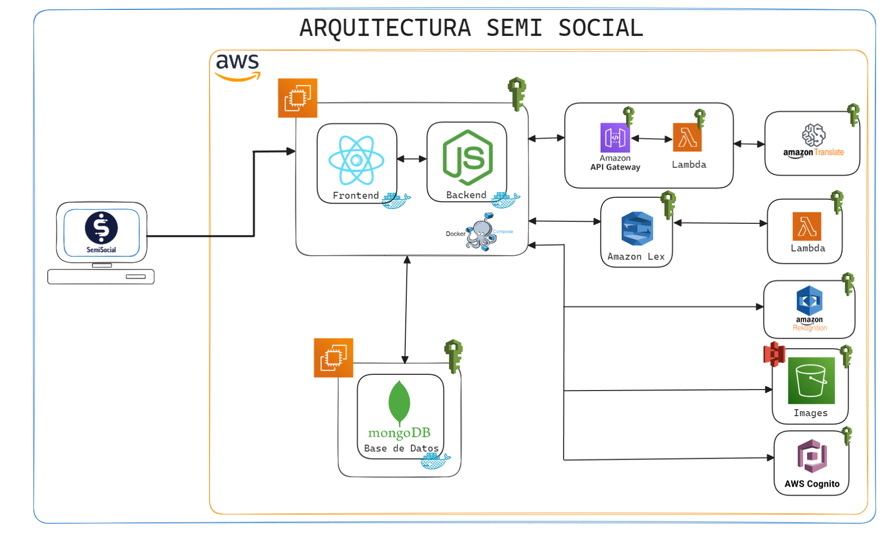

# 👥 SemiSocial

# Manual Técnico

## INDICE

- [👥 SemiSocial](#-semisocial)
- [Manual Técnico](#manual-técnico)
  - [INDICE](#indice)
  - [Introducción](#introducción)
  - [Objetivos](#objetivos)
    - [Objetivo General](#objetivo-general)
    - [Objetivos Específicos](#objetivos-específicos)
  - [Arquitectura del Proyecto](#arquitectura-del-proyecto)
  - [Estructura del Proyecto](#estructura-del-proyecto)
  - [Descripción de los Servicios de AWS](#descripción-de-los-servicios-de-aws)
    - [Amazon S3](#amazon-s3)
    - [Amazon Rekognition](#amazon-rekognition)
    - [Amazon Translate](#amazon-translate)
    - [Amazon Lex](#amazon-lex)
    - [Amazon Cógnito](#amazon-cógnito)
    - [Amazon EC2](#amazon-ec2)
    - [Amazon API Gateway](#amazon-api-gateway)
    - [Amazon Lambda](#amazon-lambda)
    - [IAM](#iam)
  - [Conclusiones](#conclusiones)

## Objetivos

### Objetivo General

### Objetivos Específicos

## Arquitectura del Proyecto

## Estructura del Proyecto

## Descripción de los Servicios de AWS

Para la realización de este proyecto se utilizó el proveedor de servicios en la nube de AWS, en donde se utilizó los siguientes servicios:

### Amazon S3

### Amazon Rekognition

### Amazon Translate

### Amazon Lex

### Amazon Cógnito

### Amazon EC2

### Amazon API Gateway

### Amazon Lambda

### IAM

## Conclusiones
