# 👥 SemiSocial

<div align="center"></div>

# Manual Técnico

## INDICE

- [Manual Técnico](#manual-técnico)
  - [INDICE](#indice)
  - [Objetivos](#objetivos)
    - [Objetivo General](#objetivo-general)
    - [Objetivos Específicos](#objetivos-específicos)
  - [Arquitectura del Proyecto](#arquitectura-del-proyecto)
  - [Estructura del Proyecto](#estructura-del-proyecto)
      - [NodeJS](#nodejs)
    - [React](#react)
    - [MongoDB](#mongodb)
    - [Docker](#docker)
  - [Descripción de los Servicios de AWS](#descripción-de-los-servicios-de-aws)
    - [S3](#s3)
      - [Buckets](#buckets)
    - [Amazon Rekognition](#amazon-rekognition)
    - [Amazon Translate](#amazon-translate)
    - [Amazon Lex](#amazon-lex)
    - [Amazon Cógnito](#amazon-cógnito)
    - [Amazon EC2](#amazon-ec2)
    - [Amazon API Gateway](#amazon-api-gateway)
    - [Amazon Lambda](#amazon-lambda)
    - [IAM](#iam)
      - [Usuarios](#usuarios)
      - [Grupos de Usuarios](#grupos-de-usuarios)
      - [Políticas creadas](#políticas-creadas)
  - [Conclusiones](#conclusiones)

## Objetivos

### Objetivo General

Desarrollar un aplicación de tipo red social que permita a los usuarios compartir publicaciones, interactuar con otros usuarios y poder traducir textos a diferentes idiomas, además de que puedan usar la inteligencia artificial con bots para interactuar con el y saber acerca de los cursos de la facultad de ingenieria, contando con ello la aplicación desplegada en AWS para que cualquier usuario pueda acceder a ella.

### Objetivos Específicos
 1. Estructurar eficientemente el proyecto.
 2. Implementar servicios y APIs de AWS
 3. Crear una interfaz de usuario amigable y atractiva, fácil de utilizar proporioconando una buena experiencia al usuario.
4. Implementar un sistema de autenticación y registro de usuarios haciendo uso de Amazon Cognito.
5. Utilizar la tecnología de inteligencia artificial de los servicios de AWS para poder hacer interacción con los usuarios desde el reconocimiento facial, traducción de textos y bots. 

## Arquitectura del Proyecto


Nuestra arquitectura esta conformada en donde existe un cliente que serian los usuarios, donde se le mostrara una interfaz de react levantada en EC2 con docker que tiene conexion con una api en NodeJS que esta levantada en la misma EC2 con docker ambos en docker compose, esta api tiene conexion con una base de datos en MongoDB que esta levantada en una distinta EC2 con docker. Ademas se utilizo servicios de AWS como S3, Rekognition, Translate, API Gateway, Lambda, Lex, Cognito e IAM que se conectaron con el servidor en NodeJS.

## Estructura del Proyecto

#### NodeJS
<div align="center"></div>

Para la realización de la API desarrollada en NodeJS se utilizó el framework de Express, el cual es un framework de NodeJS que permite la creación de API's de forma sencilla.

Tambien se utilizó la librería de Multer para poder subir archivos a S3, también se utilizo cognito y rekognition para la autenticación y reconocimiento facial de los usuarios, aws-jwt para la generación de tokens, aws-sdk para la conexión con los servicios de AWS como S3, Rekognition, Translate, API Gateway.

Para poder conectase a la base de datos se utilizó la librería de Mongoose, la cual es una librería de NodeJS que permite la conexión con MongoDB.

Para poder ejecutar el proyecto se debe ejecutar el siguiente comando:

```
npm run dev
```

Para esto se necesita tener instalado NodeJS y MongoDB; además de haber instalado las dependencias del proyecto que se encuentran en el archivo [`package.json`](../Server/package.json).

El código de la API se encuentra en la carpeta [`Server`](../Server/) en donde se encuentra la carpeta [`src`](../Server/src/) en donde se encuentra el código de la API.

Este proyecto se encuentra corriendo en un servidor EC2 en AWS en la zona de disponibilidad `us-east-1a`, a través de un contenedor de Docker en el puerto `4000`.


### React

<div align="center"></div>

Para la realización del frontend, se utilizó la librería Javascript de código abierto denominada **React**. Para su utilización, se creó el entorno de desarrollo con _*Vite*_ de la siguiente manera:

```
npm create vite@latest [Nombre del Proyecto] --template react
```

y para su ejecución, se utilizó el comando:

```
npm run dev
```

El proyecto se estructuró de tal manera para su fácil configuración, edición y que a su vez se pudiera tener eficiencia en su desarrollo. Cabe mencionar que se utilizó **Tailwind CSS**, framework de código abierto de CSS, para la creación de los componentes y el diseño de la aplicación.

### MongoDB

<div align="center"></div>

MongoDB es una base de datos NoSQL, la cual es una base de datos que no utiliza el modelo relacional de las bases de datos SQL, sino que utiliza un modelo de datos optimizado para aplicaciones modernas, el cual se basa en colecciones y documentos.

Se utlizó para almacenar los datos de los usuarios, publicaciones, comentarios, entre otros.

Para poder conectarse a la base de datos se utilizó la librería de Mongoose, la cual es una librería de NodeJS que permite la conexión con MongoDB.

Las colecciones para este proyecto son las siguientes:

- `users`: Esta colección se utiliza para almacenar los datos de los usuarios, como por ejemplo: nombre, apellido, correo electrónico, contraseña, fecha de nacimiento, entre otros.

- `publications`: Esta colección se utiliza para almacenar los datos de las publicaciones, como por ejemplo: título, descripción, imagen, fecha de creación, entre otros.

- `comments`: Esta colección se utiliza para almacenar los datos de los comentarios, como por ejemplo: contenido, fecha de creación, entre otros.

- `messages`: Esta colección se utiliza para almacenar los datos de los mensajes, como por ejemplo: contenido, fecha de creación, entre otros.

- `chats`: Esta colección se utiliza para almacenar los datos de los chats, como por ejemplo: fecha de creación, entre otros.


### Docker

<div align="center">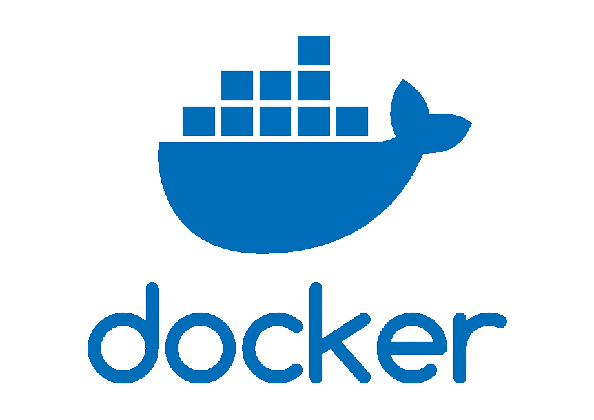</div>
Es una herramienta la cual automatiza el despliegue de aplicaciones dentro de contenedores de software, encapsulando solo las dependencias necesarias para poder ejecutar el proyecto.
<br><br>

Para poder utilizar esta herrmienta se instalo **Docker** en las maquinas virtuales. Despues se crearon los dockerfile para el frontend, backend y base de datos. Tambien se crearon dos docker compose, uno para la maquina virtual que tiene el backend y frontend, y el otro para el backend. 

Al instalar docker y registrarse, se debe ejecutar el siguiente comando para levantar los contenedores:

```
docker compose up
```

Para detener los contenedores se utliza el siguiente comando:

```
docker compose down
```

## Descripción de los Servicios de AWS
<div align="center"></div>

### S3
<div align="center"></div>

S3 es un servicio de almacenamiento de objetos que ofrece escalabilidad, disponibilidad de datos, seguridad y rendimiento. Este servicio se utiliza para almacenar y proteger cualquier cantidad de datos para una amplia variedad de casos de uso, como sitios web, aplicaciones móviles, copias de seguridad y restauraciones, archivado, aplicaciones empresariales, dispositivos IoT y análisis de big data.

#### Buckets

- `semi1proyecto-g8`: Este bucket se utilizo para poder almacenar las diferentes imagenes que se suben a la aplicacion, como por ejemplo: imagenes de perfil, imagenes de publicaciones, imagenes de comentarios, etc.

  Este bucket se encuentra en la zona de disponibilidad `us-east-1a` y se encuentra en la región `us-east-1`.

  <div align="center"></div>

  En su interior tiene una carpeta llamada `images` en donde se encuentran las imagenes que se suben a la aplicación.

  <div align="center"></div>

### Amazon Rekognition
<div align="center"></div>

Amazon Rekognition es un servicio proporcionado por AWS, centrado en el análisis de imágenes y videos, el cual permite identificar objetos, personas, texto, escenas y actividades. Entre sus principales características se encuentran:
 - Actividad del rostro
 - Comparación y búsqueda de rostros
 - Detección y análisis de rostro
 - Moderación de contenido
 - Etiquetas personalizadas
 - Detección de texto
 - Etiquetas
 - Detección de celebridades
 - Detección de segmentos de video

En el caso de Semisocial, se utilizó para dos casos:
<br>

 - **Detección de rostros:** Se implementó el servicio en el login para el reconocimiento facial de los usuarios, con el fin de poder validar su identidad y así poder acceder a la aplicación.

 - **Etiquetas:** Se implementó el servicio en la sección de publicaciones, con el fin de poder obtener una lista de etiquetas de las imágenes publicadas y luego poder filtrar estas.

### Amazon Translate

<div align="center"></div>

Amazon Translate es un servicio de traducción automática neural que ofrece traducciones de idiomas de alta calidad y a bajo costo a escala. Amazon Translate permite a las organizaciones comunicarse de manera más efectiva y alcanzar a más clientes en todo el mundo.

En el caso de Semisocial, se utilizó para dos casos:
<br>

 - **Traducción de texto:** Se implementó el servicio en la sección de publicaciones y comentarios, con el fin de poder traducir los textos de las publicaciones a los idiomas que el usuario desee, entre ellos: español, inglés, italiano y francés.

 - **Traducción con el bot:** Se implementó el servicio en el bot, con el fin de poder traducir los textos que el usuario envíe al bot a los idiomas que el usuario desee, entre ellos: español, inglés, italiano y francés.

### Amazon Lex

<div align="center"></div>


Amazon Lex es un servicio para crear interfaces de conversación en cualquier aplicación utilizando voz y texto. Amazon Lex proporciona las mismas tecnologías de aprendizaje profundo que Amazon Alexa, para que pueda crear fácilmente interfaces de conversación para sus propios chatbots o aplicaciones de voz. 

En el caso de Semisocial, se utilizó para crear un bot que permita a los usuarios interactuar con la aplicación, con el fin de poder consultar información de la aplicación, como por ejemplo: información de la red de cursos de la Facultad de Ingeniería de la Universidad de San Carlos de Guatemala, información de los horarios de los cursos de la carrera de Ingeniería en Sistemas, preguntas y frecuentes y ayuda para traducir textos.

### Amazon Cógnito
<div align="center"></div>

Amazon Cognito es un servicio que proporciona un marco de autenticación, autorización y gestión de usuarios para aplicaciones web y móviles. Puede integrar fácilmente Cognito con cualquier aplicación escrita en cualquier lenguaje de programación, como Java, JavaScript, Python, etc.

En el caso de Semisocial, se utilizó para dos casos:
<br>

 - **Autenticación:** Se implementó el servicio en el login para la autenticación de los usuarios, con el fin de poder validar su identidad y así poder acceder a la aplicación. Gracias a que este provee un token de acceso, se puede utilizar para la autenticación de los usuarios en la aplicación.

 - **Registro de usuarios:** Se implementó el servicio en el registro de usuarios, con el fin de poder registrar a los usuarios en la aplicación. Aca se registraron los usuarios con su nombre, apellido, dpi, correo electronico y contraseña.

Se tomo como usuario el correo electronico y la contraseña, y se utilizo el metodo de autenticacion de usuario y contraseña.

### Amazon EC2

### EC2

<div align="center"></div>

Amazon Elastic Compute Cloud (Amazon EC2) fue utilizado en nuestro proyecto para poder alojar los servidores en donde se alojan 2 dockers compose donde en una instancia se aloja el frontend y el backend y en la otra instancia se aloja la base de datos.

#### Instancias

- `front-back-semisocial`: En esta instancis aloja el docker compose de las imagenes del frontend y backend teniendo habilitados los puertos 5173 y 4000 `us-east-1a`.

- `base-datos-semisocial`: En esta instancia se aloja el docker compose que tiene la imagen de mongodb teniendo habilitado el puerto 27017 `us-east-1a`.

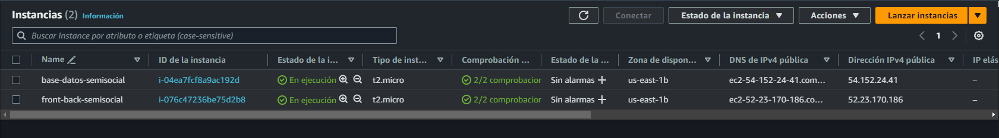

Se crearon 2 Security Groups para poder tener acceso a los puertos de las instancias.

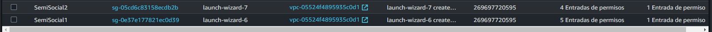

### Amazon API Gateway

<div align="center">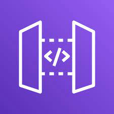</div>

Esta crea API RESTFUL la cual se basa en http implementando metodos estandar (GET, POST, PUT, PATCH y DELETE), tambien habilitan la comunicacion entre cliente servidor. Se utilizo **API Gateway** para poder establecer una comunicacion con Amazon Lambda.

Proporciona varias caracteristicas como el ruteo y transformacion de solicitudes, control de acceso, monitoreo y analisis, gestion de versiones, optimizacion del rendimiento, entre otros. 
 
### Amazon Lambda

<div align="center"></div>

Es un servicio de computación en la nube ofrecido por Amazon Web Services (AWS) que permite a los desarrolladores ejecutar código en respuesta a ciertos eventos sin necesidad de provisionar o administrar servidores, lo que lo convierte en una oferta de computación sin servidor.

Amazon Lambda ayuda a los desarrolladores a construir aplicaciones más rápidamente y les permite innovar y responder rápidamente a los cambios en el entorno empresarial sin preocuparse por la infraestructura subyacente.

### IAM

<div align="center"></div>

Para poder realizar la conexión entre los servicios de AWS se utilizó IAM, en donde se crearon distintos roles para poder acceder a los distintos servicios. Asi mismo tambien se crearon distintos usuarios para poder acceder a los distintos servicios dependiendo del rol que desempeñaran en el desarrollo. A si mismo a cada desarrollador se le asigno un usuario con un rol especifico para poder acceder a los servicios que necesitaban para el desarrollo.

### Usuarios

Se crearon los siguientes usuarios con los números de carnet de los desarrolladores:

- `201900042`
- `201901772`
- `202004745`
- `202010918`
- `201901121`

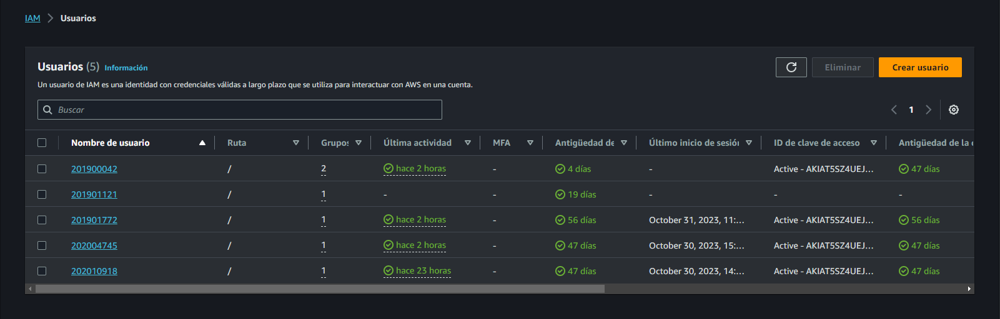

### Grupos de Usuarios

Se crearon los siguientes grupos de usuarios:

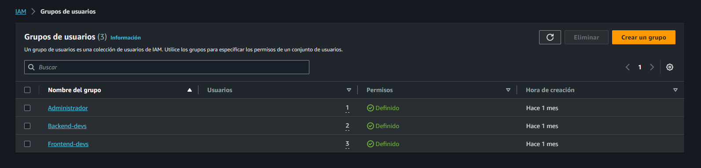

- `Administrador`: Los usuarios que tengan acceso a este grupo contarán con el acceso a todos los servicios de AWS, asi mismo tambien tienen control a todos los servicios de AWS.

    Cuenta con los siguientes permisos:
    - AdministratorAccess

    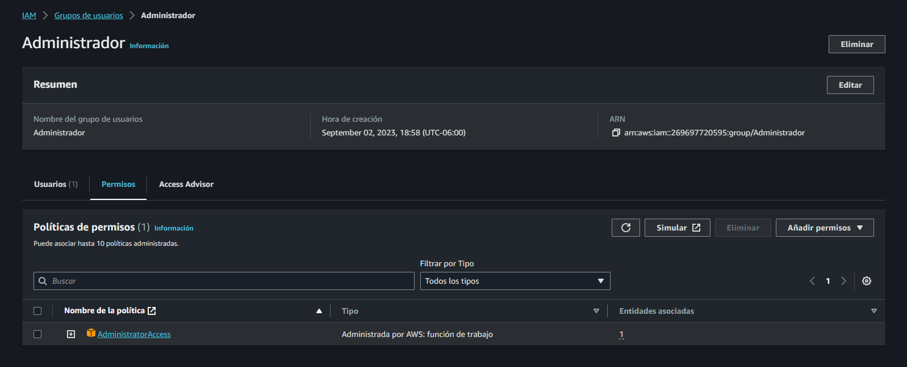

    Los usuarios que cuentan con este permiso son los siguientes:
    - `201900042`

    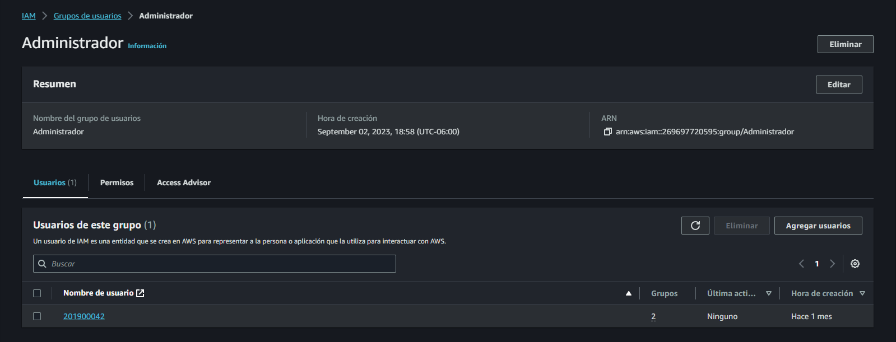

- `Backend-devs`: Los usuarios que tengan acceso a este grupo contarán con el acceso a los servicios de EC2, IAM, Cógnito, S3, Lambda, Api Gateway, Translate, Rekognition.

    Cuenta con los siguientes permisos:
    - AmazonEC2FullAccess
    - AmazonCognitoFullAccess
    - AmazonS3FullAccess
    - IAMFullAccess
    - AmazonAPIGatewayAdministrator
    - AmazonRekognitionFullAccess
    - AmazonTranslateFullAccess
    - AWSLambda_FullAccess

    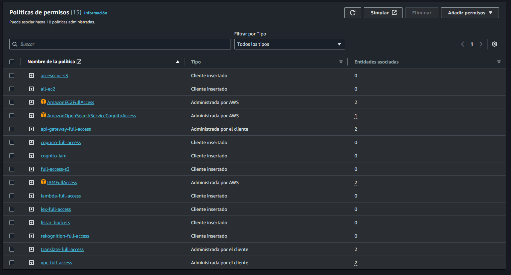

    Los usuarios que cuentan con este permiso son los siguientes:
    - `201901772`
    - `202004745`

    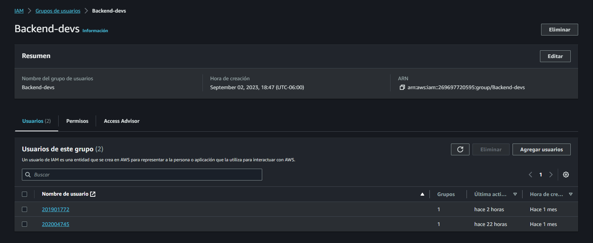

- `Frontend-devs`: Los usuarios que tengan acceso a este grupo contarán con el acceso a los servicios de EC2, S3 E IAM.

    Cuenta con los siguientes permisos:
    - AmazonEC2FullAccess
    - IAMFullAccess

    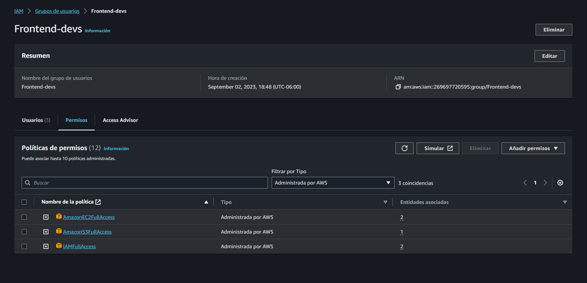

    Los usuarios que cuentan con este permiso son los siguientes:
    - `201900042`
    - `202010918`
    - `201901121`

    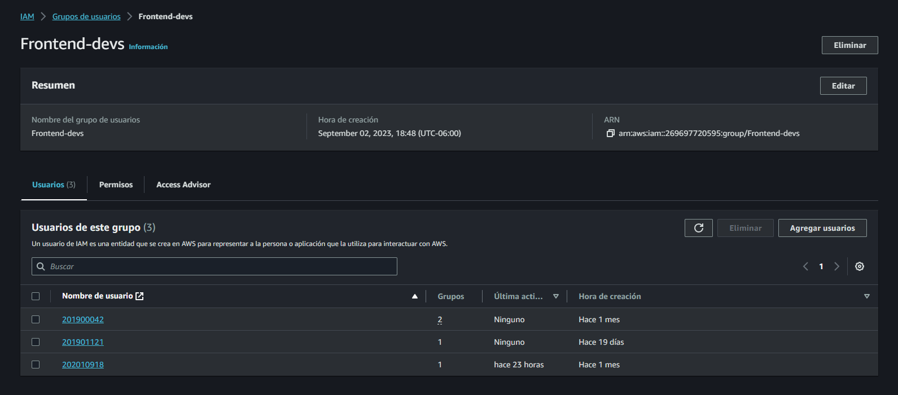

### Políticas creadas

Se crearon las siguientes políticas:

- `acceso-pc-s3`: Para tener el acceso a acceder y manipular S3.
- `api-gateway-full-access`: Para tener el control de api-gateway.
- `AWSLambdaBasicExecutionRole-53496c6d-7a7f-4d2a-8be2-533bf51e5d3b `: Para poder escribir en Lambda.
- `translate-full-access`: Para tener el control de translate.
- `vpc-full-access`: Para tener el control de vpc.

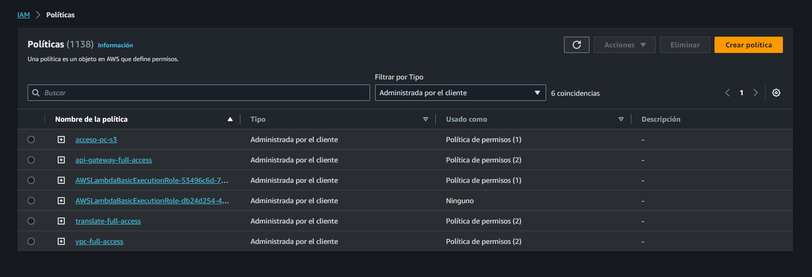


## Conclusiones
1. Con una estructuración del proyecto de manera eficiente, se logró tener un mejor control de los archivos y una mejor organización de los mismos. Esto permitió que el desarrollo del proyecto fuera más rapido por parte de los integrantes y que se pudiera tener un mejor control de los cambios realizados, dando resultado a la facilitación en navegación y edición del proyecto, así como también a la reducción, prevención y corrección de errores que surgieron durante el desarrollo de este.

2. Al trabajar con servicios de AWS se pueden observar las ventajes que tienen al implementarlas en el proyecto, asi como la reduccion de carga operativa (Lambda), la escalabilidad automatica para manejar el trafico y la demanda (API Gateway), gestion de identidad y acceso (Cognito), reconocimiento de imagenes (Rekognition), entre otros. Estas ventajas conducen a una mayor eficiencia, entrega rapida, reduccion de costos operativos y poder responder a los cambios en cualquier momento.

3. El diseño de la interfaz se centró en la estética y la facilidad de uso, lo que permitió que los usuarios pudieran utilizar la aplicación de manera intuitiva y sin complicaciones. Además, se utilizó una paleta de colores que permitiera una mejor visualización de la aplicación y que fuera agradable a la vista del usuario.

4. Es importante implementar un sistema de autenticación y registro de usuarios, ya que esto permite que los usuarios puedan acceder a la aplicación de manera segura y que sus datos estén protegidos. Además, esto permite que los usuarios puedan registrarse en la aplicación y así poder utilizarla.

5. El uso de las herramientas de la tecnología de inteligencia artificial ayuda a que comencemos a adaptar los sistemas o proyectos en base a ello y que se pueda tener una mejor experiencia de usuario, ya que esto permite que los usuarios puedan interactuar con la aplicación de una manera más sencilla, automatizada y que puedan tener una mejor experiencia de usuario.